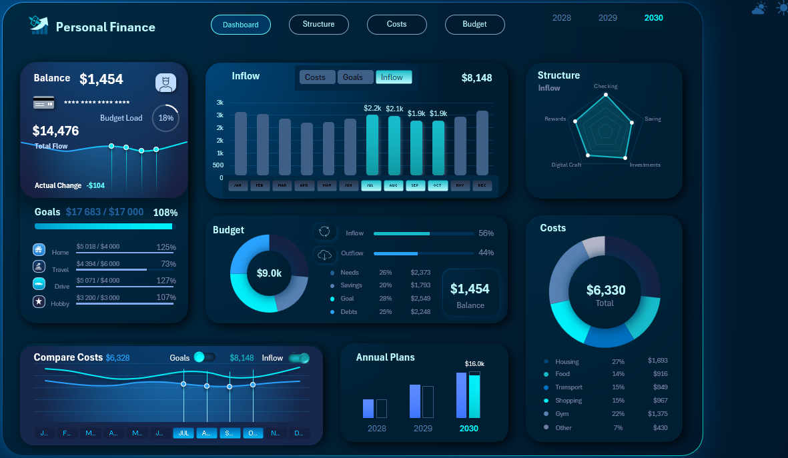

# 💰 Personal Finance Excel Dashboard

## 📌 Overview
This project is an interactive Excel dashboard designed to help users monitor their personal finances by tracking income, expenses, savings, and spending patterns.

## 🛠️ Tools Used
- Microsoft Excel
- Pivot Tables
- Pivot Charts
- Slicers
- Conditional Formatting

## ✨ Features
- Income & Expense Summary
- Monthly Financial Analysis
- Expense Categories Breakdown
- Savings Tracking
- Interactive Dashboard

## 📷 Dashboard Preview

## 📂 Files
- `Personal Finance.xlsx` – Excel dashboard
- `dashboard-preview.png` – Dashboard screenshot

## 👨‍💻 Author
**Mina Mamdouh**
